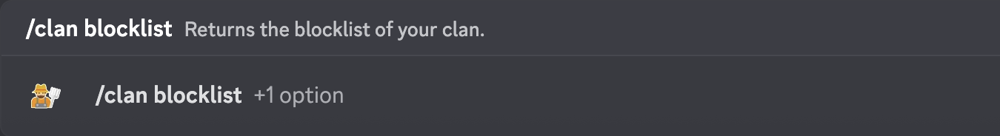
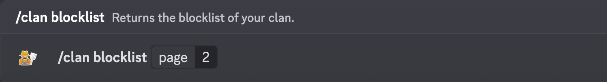

# /clan blocklist

Returns the blocklist of your clan.

> [!NOTE]
> This command requires clan verification.

## Usage

```
/clan blocklist {page}
```

## Arguments

| Name | Description             | Type   | Required |
| :--: | :---------------------: | :----: | :------: |
| page | The number of the page. | Number | No       |

## Examples

\
