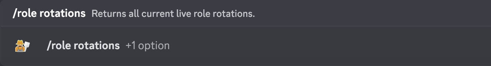
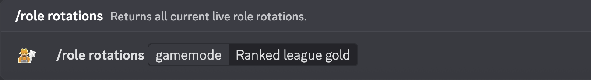

# /role rotations

Returns all current live role rotations.

## Usage

```
/role rotations {gamemode}
```

## Arguments

| Name     | Description                                                 | Type | Required |
| :------: | :---------------------------------------------------------: | :--: | :------: |
| gamemode | The game mode from which role rotations should be returned. | Enum | No       |

### Possibilities

<!-- tabs:start -->

#### **gamemode**

- `Quick game` - Returns Quick game role rotations.
- `Advanced game` - Returns Advanced game role rotations.
- `Sandbox` - Returns Sandbox role rotations.
- `Ranked league silver` - Returns Ranked league silver role rotations.
- `Ranked league gold` - Returns Ranked league gold role rotations.
- `Crazy fun` - Returns Crazy fun role rotations.

<!-- tabs:end -->

## Examples

\
