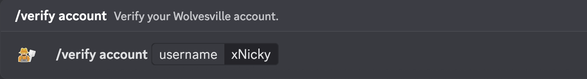

# /verify account

Verify your Wolvesville account.

## Usage

```
/verify account <username>
```

## Arguments

| Name     | Description                  | Type   | Required |
| :------: | :--------------------------: | :----: | :------: |
| username | Your exact in-game username. | String | Yes      |

## Examples

