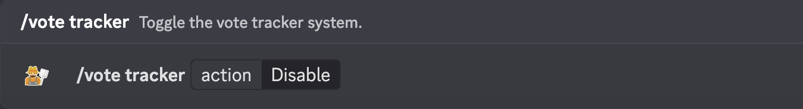

# /vote tracker

Toggle the vote tracker system.

## Usage

```
/vote tracker <action>
```

## Arguments

| Name   | Description                   | Type | Required |
| :----: | :---------------------------: | :--: | :------: |
| action | Select the action to perform. | Enum | Yes      |

### Possibilities

<!-- tabs:start -->

#### **action**

- `Enable` - Enables the vote tracker system.
- `Disable` - Disables the vote tracker system.

<!-- tabs:end -->

## Examples

\
